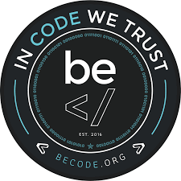
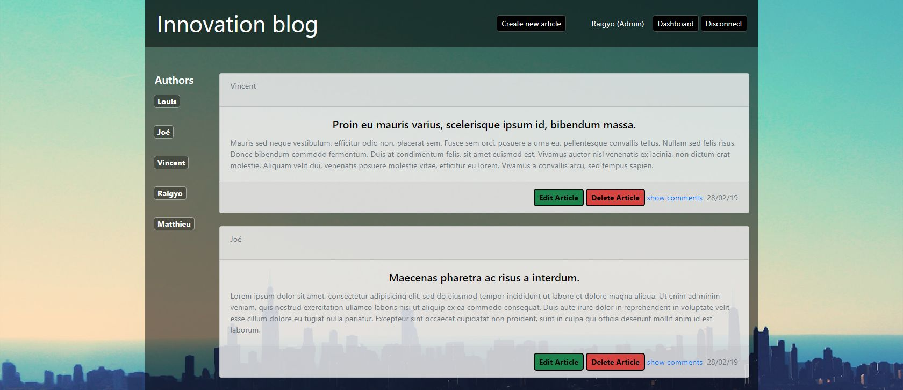

# Becode  JEPSEN LG - Create your blog!



*March 2019 (update: October 2020)*

> 🔨 client server application using PHP that allows users to post articles, comment them or delete them according their user rights.

* * *



## UPDATE OCTOBER 2020: To use the application locally

### Prerequisite

You will need already installed:

- PHP

- Composer

- Postgresql drivers (ex: `sudo apt-get install php7.4-pgsql`)

### Launch the app:

- Clone

- run: `composer install` or `composer update`.

Then to launch postgresql and Adminer:

- `docker-compose create`

- `docker-compose start`

- To access Adminer: `http://localhost:9000/`

To launch the app:

- `php -S localhost:8888 -t public public/index.php`

### Credentials for DB can be changed in:

- ./docker-compose.yml

- ./app/settings.php and dependencies.php (host and port)

Note:

To display css using php Internal server use, in index.php:

````php

if (PHP_SAPI == 'cli-server') {
  $_SERVER['SCRIPT_NAME'] = basename(__FILE__);
  // To help the built-in PHP dev server, check if the request was actually for
  // something which should probably be served as a static file
  $url  = parse_url($_SERVER['REQUEST_URI']);
  $file = __DIR__ . $url['path'];
  if (is_file($file)) {
      return false;
  }
}

````

Then in layout.twig:

````twig

<link rel="stylesheet" type="text/css" href="{{ base_url() }}/css/style.css">

````

CSS have to be in:

`./public/css/style.css`

---------------------------

## Contributors

- [Louis Cantinieaux](https://github.com/LouisCantinieaux)
- [Vincent Chilot](https://github.com/Raigyo)
- [Matthieu Jasselette](https://github.com/MatthieuJasselette)
- [Joé Michel](https://github.com/joe-michel)

## Goal of the exercice

We had to create a client server application that allows users to post articles, comment them or delete them according their user rights. The feature requested are those usually encountered in blogs.

Our clients were our Becode coaches:
[Nicolas Vanhoren](https://github.com/nicolas-van) and [Nicolas 'Jules' Jamar](https://github.com/NicolasJamar)

The project started on **Monday 25th of February 2019** and the deadline was for **Friday 15th of March 2019**.

The delivery was provided on the following private server: [http://jepsen.local/~lcantini/](http://jepsen.local/~lcantini/)

## Technologies covered by the exercise

* Use of PHP Slim Framework (routing / CRUD, PSR7 request objects, Forms...)
* Use of Composer, vendors, namespaces
* Use of Twig and container dependencies injection (DI)
* PHP Data Objects (PDO) to connect the database and bcrypt for password encryption
* PostgreSQL database
* Website and database deployment using scripts and Bash

## Using the application (Front-end part)

According to your rights, you will be able to use some features:

### As unregistered user

You can see the articles and commentaries, sort them by author, date or categories. You can register using the button sign-up.

### As registered user

You have one more feature: you can add comments! Your comment will be displayed under the articles with your user name. Comment can be deleted by the administrator so please remain civil.

### As author

As author you have the same features than above but you can also add articles! And your name will be displayed in the author list. You can choose one or more categories for your article.

### As administrator

You have full rights! On the landing page you can add, modify or delete an article. You can also do that with the categories, authors or dates. For more convenience, you have access to a dashboard page that allows you to make these operations quickly and easily.
Moreover, you can also change the right for existing users, so a user can become an author and vice-versa.

## Deploying the application (Back-end part)

- First connect to your server with your username.
- Then clone the repo [here](https://github.com/Raigyo/blog-php/)
- Finaly go on the internet and open the website (the adress should be **serverName.local/~username**).
- The server will look by default for the **index.php** within  the **public_html** folder 

### Architecture of the website

├── app

│   ├── dependencies.php

│   ├── routes.php

│   └── settings.php

├── bootstrap

│   └── app.php

├── css

│   └── style.css

├── templates

│   ├── partials

│   │   ├── footer.twig

│   │   └── nav.php

│   ├── about.twig

│   ├── contact.twig

│   ├── home.twig

│   └── layout.twig

├── vendor

│   ├── Several folders used by composer

│   └── autoload.php

├── composer.json

├── composer.lock

├── composer.phar

├── deploy.sh

├── index.php

├── installer

├── package-lock.json

└── README.md


**--app/dependencies--**

Container service for Twig-Views, DB connection and SQL request results.

**--app/routes--**

PSR 7 request object + routing and functions displaying content according user actions.

**--app/settings--**

Object setting to indicate to the application where to find our twig templates + object to define DB Settings.

**--bootstrap/app--**

Slim Application setting and bootstrapping.

**--templates/partial--**

Common parts of the twig templates.

**--templates--**

Templates for each page + general layout.

**--index--**

Landing page, launch bootstrap and the application.


## Sources and documentation

[Slim documentation](http://www.slimframework.com/docs/)

[The workshop of Marco De Bona and Valentin Grégoire from Becode/Hamilton about Bash and scripting](https://github.com/AnarionBe/BashIt)
